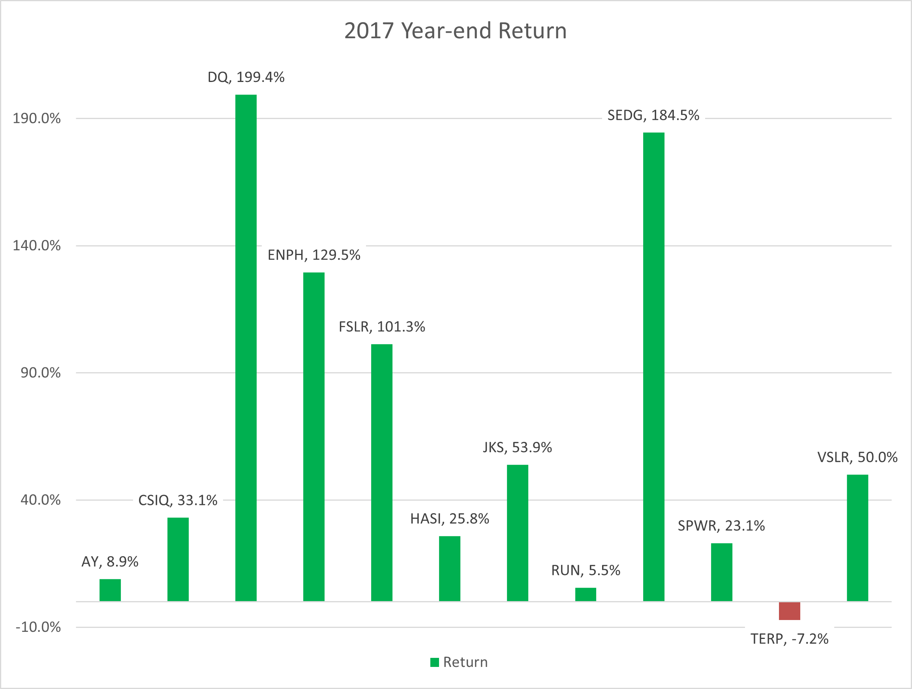
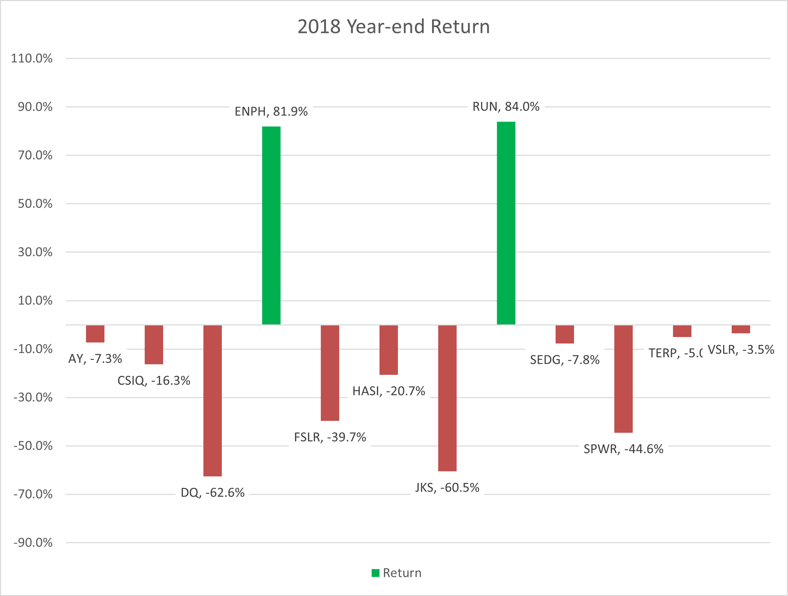
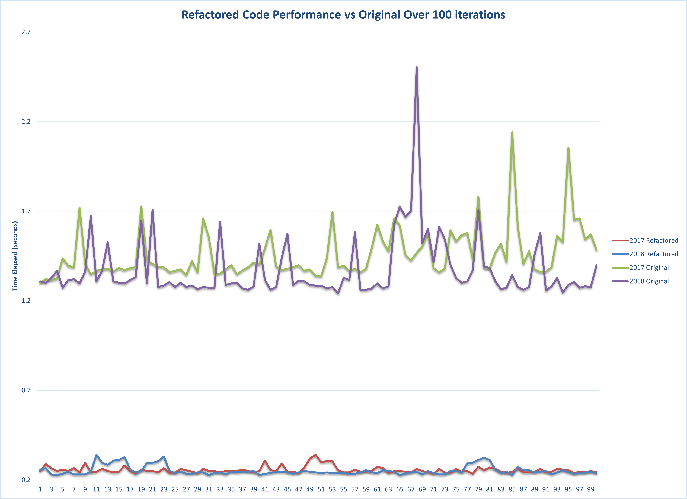
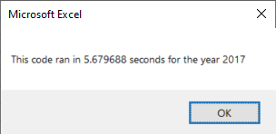
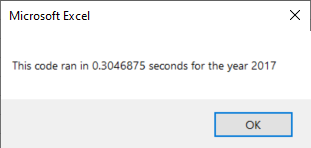

# VBA of Wall Street

## Overview of Project

This project developed a macro tool using VBA for Steve to analyze datasets of stock market data. The dataset for this project included stock market data from two years, 2017 (n=3012) and 2018 (n=3012). For each date of the 12 stocks, the closing prices and volumes were used in the analysis. The macro that was designed had a program flow that looped through all of the tickers for each stock, calculated the total daily volume and the rate of return from the starting and ending price over the course of the year for each individual ticker. To ease usability within the workbook, macro buttons to run the analysis were made to provide Steve the a user input choice of the year.  

### Purpose

The original script that was written used a nested for loop in order to extract the data for each individual stock ticker which worked well enough for the 12 stocks in the dataset. In the future, Steve would like to run this analysis on thousands of stocks and does not want to have to wait very long for the analysis to finish running. The purpose of this project was to refactor the script to only use one loop to collect the necesary data to to the analysis and test if the refactored code performed more efficiently than the original.   

## Results

### Stock Performance between 2017 and 2018
The analysis of stocks reveal that over all, most stocks had net gains during the year of 2017 and net losses during the year of 2018 (Figures 1 & 2). During 2017, the two stocks with the highest return were DQ (199.4%) and SEDG (184.5%). The only stock with negative returns during 2017 was TERP, which remained negative in 2018. TERP was the only stock which showed negative returns for both years. The analysis of the returns from 2018 showed that DQ had the lowest return (-62.6%). The only stock which had positve year end returns for both 2017 and 2018 was ENPH. If Steve were to suggest an investment option for his parents based on these analyses, ENPH has the best investment potential. 

**Figure 1. Bar chart of 2017 year end return**


**Figure 2. Bar chart of 2018 year end return**


### Performance enhanced using refactored script
The main purpose of this challenge was to refactor the original script to increase running time efficiency so that Steve could increase the number of stock market data he was running the analysis on while maintaining a reasonable time estimate for the analysis to take place. The approach to the refactored code was the elimination of a nested for loop logic to a single loop. The original script had the following nested loop logic:
```vbscript
For i = 0 To 11
    
        ticker = tickers(i)
        totalVolume = 0
    
    'Loop through rows in the data.
    'Activate the data worksheet.
    
        Worksheets(yearValue).Activate
    
        For j = 2 To RowCount
            
            '5a) Get total volume for current ticker
            If Cells(j, 1).Value = ticker Then

               totalVolume = totalVolume + Cells(j, 8).Value

            End If
           
            'Find the starting price for the current ticker.
            If Cells(j - 1, 1).Value <> ticker And Cells(j, 1).Value = ticker Then

                startingPrice = Cells(j, 6).Value

            End If

            'Find the ending price for the current ticker.
            If Cells(j + 1, 1).Value <> ticker And Cells(j, 1).Value = ticker Then

                endingPrice = Cells(j, 6).Value

            End If
            
        Next j
        
    'Output the data for the current ticker.
    Worksheets("All Stocks Analysis").Activate
    Cells(4 + i, 1).Value = ticker
    Cells(4 + i, 2).Value = totalVolume
    Cells(4 + i, 3).Value = endingPrice / startingPrice - 1
    
Next i
```
This nested loop is not needed. In this approach, the solution matrix storing the daily volume and year end return is dynamically changing its size throughout each change in the ticker resulting in a longer runtime. The average runtime for this script over the dataset was 1.37 seconds to 1.46 seconds for 2018 and 2017 respectively (Table 1; Figure 3).

The approach to refactoring this script is to initialize a solution array which then stores results (step 1a in the comments of the follwing code), thus eliminating the need for the first loop in the original script. This was done by using a ```tickerIndex``` which was used to index stored data from the ```ticker```, ```tickerVolumes```, ```tickerStartingPrices```, and ```tickerEndingPrices```.  For example, to store the volume for a given ticker, the following syntax is used: ``` tickerVolumes(tickerIndex) = tickerVolumes(tickerIndex) + Cells(i, 8).Value```. At the end of each ticker, data is stored, and the ```tickerIndex``` is increased to retrieve the next ticker within the ```tickers``` array. The logic in the refactored approach is as follows:
```vbscript
    ''2a) Create a for loop to initialize the tickerVolumes to zero.
    For i = 0 To 11
    
        tickerVolumes(i) = 0
    
    Next i
    
    '1a) Create a ticker Index
    Dim tickerIndex As Single
    tickerIndex = 0
    
    'Refactored script: Start the single loop to go over all of the tickers using the advancing
    'ticker index instead of the nested for loop logic
    
    For i = 2 To RowCount
       
    'use the ticker index to grab the ticker from the stocks array
    ticker = tickers(tickerIndex)
    
       '3a) Increase volume for current ticker using the ticker index
        If Cells(i, 1).Value = ticker Then

               tickerVolumes(tickerIndex) = tickerVolumes(tickerIndex) + Cells(i, 8).Value

        End If
        
        '3b) Check if the current row is the first row with the selected tickerIndex.
        If Cells(i - 1, 1).Value <> ticker And Cells(i, 1).Value = ticker Then

                tickerStartingPrices(tickerIndex) = Cells(i, 6).Value

        End If

        '3c) check if the current row is the last row with the selected tickerIndex
        If Cells(i + 1, 1).Value <> ticker And Cells(i, 1).Value = ticker Then

                tickerEndingPrices(tickerIndex) = Cells(i, 6).Value
                 
                'If the next row’s ticker doesn’t match, increase the tickerIndex.
                tickerIndex = tickerIndex + 1
                
        End If
              
    Next i
```

The results were then output using the index of each ticker as follows:

```vbscript
    '4) Loop through the arrays to output the Ticker, Total Daily Volume, and Return.
    For i = 0 To 11
        
        Worksheets("All Stocks Analysis").Activate
            'Output the data for the each ticker.
    
        Cells(4 + i, 1).Value = tickers(i)
        Cells(4 + i, 2).Value = tickerVolumes(i)
        Cells(4 + i, 3).Value = tickerEndingPrices(i) / tickerStartingPrices(i) - 1
        
    Next i
```

To assess the increased performance of the refactored code and to simulate the use of this code to run a larger dataset, an iteration set up was constructed which was able to run each version 100 times, and save the runtime of each iteration. For more information and to see the VBA code for this, open the macro enabled workbook in the ./stock-analysis/Iteration_Time_Analysis/ directory. This approach is able to simulate a the amount of time it would take either version to complete the analysis on a dataset of n=310,200 (n=3012 * 100 iterations). The results from these runs are summarized in Table 1 and are visualized in the line plot of Figure 3. Screenshots of the single run message box output of runtime per challenge instructions from the module are also included in Figures 4 & 5.

The refactored script was able to reduce the runtime of the original code by a factor of 5.45 on average. In addition to reducing runtime, the total variance of runtime is also reduced (Table 1). Over 100 iterations, the original script had an average runtime of 1.37 to 1.46 seconds with a sample standard deviation of 0.14 to 0.18 seconds. The refactored script had an average runtime 0.25 seconds and a sample standard deviation of 0.019 to 0.026 seconds (Table 1). The longer runtime of the original script and higher variance of runtime make the performance of the original less stable and more unreliable to Steve in future analyses. Using the refactored script, Steve can run a larger analysis in a fraction of the time and estimate the time needed for a larger analysis more confidently given the smaller variance in runtime. 

**Table 1. Statistics of the refactored script and original over 100 iterations**

| **Year**            | **Total Iterations** | **Total Time Elapsed** | **Average Run Time** | **s<sup>2</sup><sub>n-1</sub>**       |
|-----------------|------------------|--------------------|------------------|-------------|
| Refactored 2017 | 100              | 25.55          | 0.2555       | 0.0191 |
| Refactored 2018 | 100              | 25.21        | 0.2521      | 0.0264 |
| Original 2017   | 100              | 143.14         | 1.461      | 0.1410 |
| Original 2018   | 100              | 134.70         | 1.375      | 0.1762 |

**Figure 3. Line plot showing the performance of the refactored script vs the original over 100 iterations** 


**Figure 4. Screenshot of original script runtime message box output in excel**



**Figure 5. Screenshot of refactored script runtime message box output in excel** 




## Summary

1. What are the advantages or disadvantages of refactoring code?
   - Advantages:
     - The advantages of refactoring code in general is to reduce code "smell" such as code duplication, fix bugs, redundant logic, and increase flexibility/adaptability for           future additions or varibale datasets. By refactoring code, one can improve performance, enahnce end product aesthetics, or simply design a code which is more readily           understood to a new developer who will adopt the code in the future. Code refactoring is also a necesary step in preparation for peer review. If refactoring code prior to       submission is done, there will be less of a chance of code smell being detected in the peer review process.
   - Disadvantages: 
     - The disadvantages of refactoring code in general relate mostly to deadline and funding limitations. For instance, if a delivery deadline is near, time is not well spent         on refactoring code as it is debugging and making sure that the original is in stable form. Also, if the cost of refactoring the code is higher than simply rewriting new         code which serves the desired purpose, it would not be recomended to refactor the code. Refactoring code can also introduce new bugs and make a larger mess of the               readability of the original, thus stable code which is understandable is also not recomended to be refactored. 
     
2. How do these pros and cons apply to refactoring the original VBA script?
   - The advantage of refactoring the original VBA script is most obviously observed in the reduced runtime of the script itself. In the context of Steve's desire to run higher volume datasets in the future, the refactored script will be preferred. Removing any obscuration introduced by an unnecesary nested for loop logic in the original improves the readability of the script. Although these advantages are realized, the code is still not adaptable to a new and unseen set of tickers. In future analyses, because the ticker index array is hard coded in and not automated, one will have to edit this array for succesful execution any time the dataset is different. Further refactoring is necesary to remove this relic from the original and make the script more dynamic and adaptable. In conclusion, the effort needed to simply improve runtime efficiency was minimal and easily implemented so that the payoff for this revision was worth it. 
